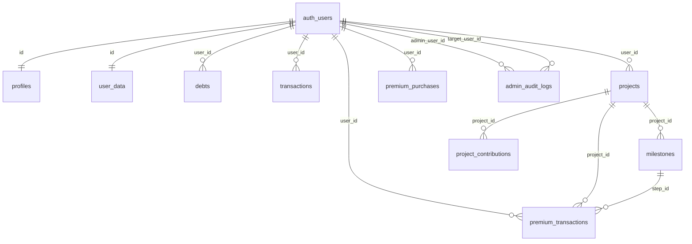

# Carte Technique Base de Donnees

## Vue rapide

`auth_users` represente `auth.users`.

## Objets par domaine

| Domaine | Objet | Role | Statut depot |
| --- | --- | --- | --- |
| Auth | `auth.users` | comptes utilisateurs Supabase | gere par Supabase |
| Admin | `admin_users` | administrateurs en base | present en base, migration absente |
| Gratuit | `user_data` | etat financier JSON | present en base, migration absente |
| Gratuit | `debts` | dettes normalisees | present en base, usage code non observe |
| Gratuit | `transactions` | transactions normalisees | present en base, usage code non observe |
| Premium | `profiles` | profil financier Plus | present en base, migration absente |
| Premium | `projects` | projets de vie | present en base, migration absente |
| Premium | `milestones` | jalons des projets complexes | present en base, migration absente |
| Premium | `project_contributions` | contributions de projets | present en base, usage code non observe |
| Premium | `premium_transactions` | journal allocations/realisations | present en base, migration absente |
| Paiement | `premium_purchases` | achats FedaPay | migration presente |
| Config | `app_settings` | configuration publique | migration presente |
| Admin | `admin_audit_logs` | audit admin | migration presente |
| Storage | `avatars` | photos profil | deduit du code, migration absente |

Inventaire direct: `supabase/audit/remote_inventory.json`.

## Volumes production

Lecture seule du 2026-06-15:

| Objet | Volume | Note rapide |
| --- | ---: | --- |
| `user_data` | 21 | source gratuite actuelle |
| `profiles` | 20 | profils Premium |
| `projects` | 10 | tous actifs |
| `milestones` | 13 | 7 completes, 6 ouverts |
| `premium_transactions` | 11 | journal Premium; contient des references orphelines |
| `premium_purchases` | 26 | acces Plus |
| `transactions` | 8 | historique gratuit/legacy a conserver |
| `admin_users` | 1 | admin DB |
| `app_settings` | 2 | `plus_plan`, `plus_offer` |
| `avatars` | 8 | objets storage |
| `debts` | 0 | vide |
| `project_contributions` | 0 | vide |
| `admin_audit_logs` | 0 | vide |

## Flux critiques

### Connexion et acces Premium

1. L'utilisateur se connecte via Supabase Auth.
2. `src/App.jsx` appelle `has_premium_access(user.id)`.
3. La fonction verifie un achat `premium_purchases.status = 'approved'`.
4. L'app affiche le portail Premium si l'acces est confirme.

### Achat Dudukan Plus

1. `src/screens/Payment.jsx` lit `app_settings.plus_plan`.
2. `api/fedapay/create-checkout.js` cree une transaction FedaPay.
3. Une ligne `premium_purchases` est upsert en `pending`.
4. `api/fedapay/webhook.js` recoit l'evenement FedaPay.
5. Si montant/devise/plan/statut sont valides, la ligne passe en `approved`.
6. Le webhook ajoute `user_metadata.is_premium = true`.

### Donnees gratuites

1. `FinanceContext` maintient l'etat dans React et `localStorage`.
2. Apres changement, `user_data` est upsert avec `id = user.id`.
3. Au chargement, le code compare `localStorage` et `user_data.updated_at`.

### Donnees Premium

1. `PremiumContext` charge `profiles`, `projects` avec `milestones(*)`, et `premium_transactions`.
2. Les allocations mettent a jour `projects.current_amount`.
3. Les jalons mettent a jour `milestones.is_completed`.
4. Les operations sont journalisees dans `premium_transactions`.
5. `profiles.savings` est synchronise partiellement avec l'epargne gratuite.

Point d'attention: `premium_transactions.project_id` et `step_id` ne sont pas encore proteges par FK et certaines references existantes sont orphelines. Ne pas ajouter de FK avant reconciliation; conserver l'historique denormalise (`project_name`, `step_name`, `metadata`).

## Dependances code principales

| Objet DB | Fichiers principaux |
| --- | --- |
| `user_data` | `src/context/FinanceContext.jsx`, `api/admin/diagnose.js`, `api/admin/sync-savings.js`, `api/admin/repair-savings-category.js` |
| `profiles` | `src/premium/context/PremiumContext.jsx`, `src/premium/PremiumApp.jsx`, `src/screens/Settings.jsx`, APIs admin |
| `projects` | `src/premium/context/PremiumContext.jsx`, `src/premium/views/AddProject.jsx`, `src/premium/views/ProjectDetail.jsx`, `src/premium/views/PremiumFunding.jsx`, `src/premium/PremiumApp.jsx` |
| `milestones` | `src/premium/context/PremiumContext.jsx`, `src/premium/views/AddProject.jsx`, `src/premium/views/ProjectDetail.jsx`, `src/premium/views/PremiumFunding.jsx` |
| `premium_transactions` | `src/premium/context/PremiumContext.jsx`, `api/admin/diagnose.js` |
| `premium_purchases` | `src/App.jsx`, `api/fedapay/create-checkout.js`, `api/fedapay/webhook.js`, `api/admin/grant-plus.js`, `api/admin/diagnose.js` |
| `app_settings` | `src/screens/Payment.jsx`, `api/_utils/plusPlan.js`, `api/admin/app-settings.js` |
| `admin_audit_logs` | `api/_utils/adminAuth.js` |
| `avatars` | `src/screens/Settings.jsx` |

Objets presents en base sans usage direct observe dans le code local: `admin_users`, `debts`, `transactions`, `project_contributions`.

Statut prudent:

- `transactions` contient 8 lignes; ne pas supprimer.
- `admin_users` contient 1 ligne; clarifier si cette table devient la source admin officielle.
- `debts` et `project_contributions` sont vides; conserver jusqu'a decision de normalisation.

## Ce qu'un agent IA doit verifier avant modification DB

1. Ne pas supprimer ou renommer une table sans chercher ses usages via `.from('table')`, `.rpc('function')` et `storage.from('bucket')`.
2. Toute migration touchant `user_data` doit preserver le JSON existant.
3. Toute migration touchant `projects` doit preserver la relation `projects -> milestones`.
4. Toute migration touchant `premium_transactions` doit preserver les lignes historiques meme si `project_id` ou `step_id` est orphelin.
5. Toute correction RLS doit etre testee avec un utilisateur authentifie non admin.
6. Les endpoints `api/admin/*` utilisent le service role et peuvent contourner RLS: auditer le controle d'acces applicatif en meme temps.
